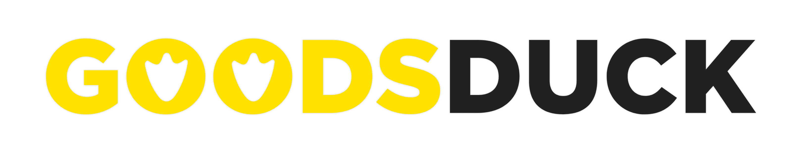
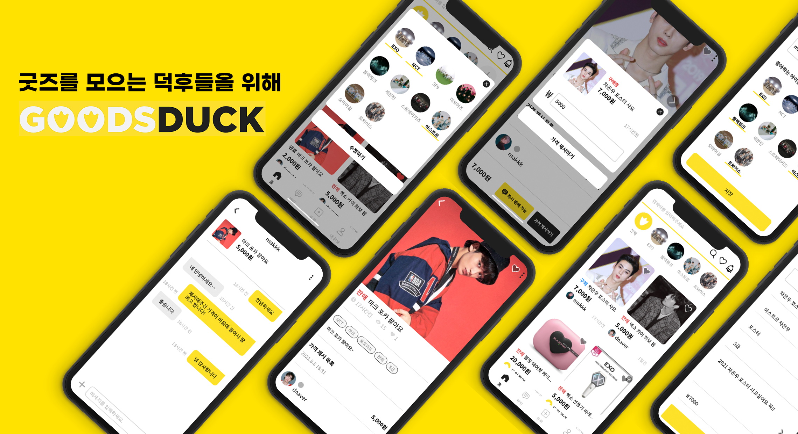

[![Contributors][contributors-shield]][contributors-url]
[![Forks][forks-shield]][forks-url]
[![Stargazers][stars-shield]][stars-url]
[![Issues][issues-shield]][issues-url]
[![MIT License][license-shield]][license-url]

![react-shield]
![postcss-shield]
![firebase-shield]
![yarn-shield]
![s3-shield]

<!-- PROJECT LOGO -->
<br />
<p align="center">
  <a href="https://github.com/soma-goodsduck/goodsduck_front">
    
  </a>

  <p align="center">
    굿즈를 모으는 덕후들을 위한 서비스
    <br />
    <a href="https://www.goods-duck.com/"><strong>goods-duck.com »</strong></a>
  </p>
</p>

<br>
<!-- TABLE OF CONTENTS -->
<details open="open">
  <summary>Table of Contents</summary>
  <ol>
    <li>
      <a href="#about-the-project">About The Project</a>
      <ul>
        <li><a href="#built-with">Built With</a></li>
      </ul>
    </li>
    <li>
      <a href="#getting-started">Getting Started</a>
      <ul>
        <li><a href="#installation">Installation</a></li>
        <li><a href="#setting-environment-variables">Setting Environment Variables</a></li>
      </ul> 
    </li>
    <li><a href="#contributing">Contributing</a></li>
    <li><a href="#license">License</a></li>
  </ol>
</details>

<!-- ABOUT THE PROJECT -->

## About The Project

<a href="https://www.youtube.com/watch?v=CF4kLo6neUs">
  
</a>

<div align="center">
  <sup><a href="https://www.youtube.com/watch?v=CF4kLo6neUs">Click for Demo Video</a> </sup>
</div>

</br>

최근 국내에는 중고거래 시장이 활성화 되었으며, 좋은 서비스를 제공하는 플랫폼들이 다수 존재합니다. 하지만, 아이돌을 덕질을 하는 팬(덕후)들을 위한 거래 플랫폼은 많지 않습니다. 이에 저희 덕스(Ducks) 팀은 팬들이 아이돌 굿즈를 모으는 과정에서 겪는 어려움과 불편함을 개선해 굿즈를 모으는 즐거움을 제공하는 플랫폼인 GOODSDUCK을 기획했습니다.

GOODSDUCK의 검증 가설은 다음과 같습니다:

- 필터링 기능을 제공하면 편한 거래 플랫폼이 될 것이고, 가격제안으로 채팅이 이어지면 시간이 줄어들 것이다.
- 투표 기능을 제공하면 유저들의 유입방안이 되고, 커뮤니티가 있으면 재밌어서 유저가 오래 머물 것이다.
- 개인화 추천 기능을 제공하면 사용자들이 우리 플랫폼을 선호하는 이유가 될 것이다.

현재 2021년 11월 6일 기준으로 Web, Android, iOS 모두 배포되었습니다. 유저는 약 750명이며, Android 다운로드 수 600 이상, iOS 다운로드 수 400 이상입니다.

- Web : https://www.goods-duck.com/
- Android : https://play.google.com/store/apps/details?id=com.goodsduck_app&pcampaignid=pcampaignidMKT-Other-global-all-co-prtnr-py-PartBadge-Mar2515-1
- iOS : https://apps.apple.com/kr/app/goodsduck/id1586463391

</br>

### Built With

- MacOS (Big Sur 11.4)
- React JS
  - node.js (version 14.17.1)
  - yarn (version 1.22.10)
  - [Create React App](https://ko.reactjs.org/docs/create-a-new-react-app.html)
- Visual Studio Code

<!-- GETTING STARTED -->

## Getting Started

### Installation

```sh
# If you never use React, plz install node and yarn.
# Install Node.js from https://nodejs.org/ko/download/
# Install yarn : brew install yarn

# Fork this repository to yours.
$ git clone [YOUR_REPOSITORY_URL]
$ cd goodsduck_front

# Install npm packages and start this project.
$ yarn
$ yarn start

```

### Setting Environment Variables

```sh
# .env
SKIP_PREFLIGHT_CHECK=true


# You need to set environment varialbes
REACT_APP_TYPE = PROD

REACT_APP_FRONT_URL_PROD = https://www.goods-duck.com
REACT_APP_FRONT_URL_DEV =
REACT_APP_BACK_URL_PROD = https://api.goods-duck.com
REACT_APP_BACK_URL_DEV =


# You need to get KAKAO JavaScript Key from https://developers.kakao.com/
REACT_APP_KAKAO_JS_API_KEY =

# Firebase Project Environment
# You have to use Realtime DataBase
REACT_APP_FIREBASE_SERVER_KEY =
REACT_APP_FIREBASE_API_KEY =
REACT_APP_FIREBASE_AUTH_DOMAIN =
REACT_APP_FIREBASE_DATABASE_URL =
REACT_APP_FIREBASE_PROJECT_ID =
REACT_APP_FIREBASE_STORAGE_BUCKET =
REACT_APP_FIREBASE_MESSAGING_SENDER_ID =
REACT_APP_FIREBASE_APP_ID =
REACT_APP_FIREBASE_MEASUREMENT_ID =

# Set Sentry for Monitoring Project
REACT_APP_SENTRY =

# Set Mixpanel for getting user activity data
REACT_APP_MIXPANEL =
```

<!-- CONTRIBUTING -->

## Contributing

This repository managed based on forked pull request strategy

```sh
# Fork this repository to yours.
$ git clone [YOUR_REPOSITORY_URL]
$ cd goodsduck_front

# Install npm packages and start this project.
$ yarn
$ yarn start

# (Working...)

$ git commit [...]
$ git push origin [YOUR_REPOSITORY]

# Enroll pull-request!
# in https://github.com/soma-goodsduck/goodsduck_front
```

### Commit message rules

Consider starting the commit message with an applicable emoji:

- ✨ `:sparkles:` : with `[feat]` prefix.
  - when create new feature.
- 🎨 `:art:` : with `[chore]` prefix.
  - when update code or format of the code.
- ♻️ `:recycle:` : with `[refactor]` prefix.
  - when refactor code.
- 🐛 `:bug:` : with `[fix]` prefix.
  - when fixing a bug.
- 📝`:memo:` : with `[docs]` prefix.
  - when add document.

## License

[MIT](./LICENSE)

<div align="center">

<sub><sup>Project by <a href="https://github.com/2dowon">@2dowon</a> <a href="https://github.com/Ting-Kim">@Ting-Kim</a> <a href="https://github.com/W0nee">@W0nee</a></sup></sub>

</div>

<!-- MARKDOWN LINKS & IMAGES -->
<!-- https://www.markdownguide.org/basic-syntax/#reference-style-links -->

[contributors-shield]: https://img.shields.io/github/contributors/soma-goodsduck/goodsduck_front.svg?style=for-the-badge
[contributors-url]: https://github.com/soma-goodsduck/goodsduck_front/graphs/contributors
[forks-shield]: https://img.shields.io/github/forks/soma-goodsduck/goodsduck_front.svg?style=for-the-badge
[forks-url]: https://github.com/soma-goodsduck/goodsduck_front/network/members
[stars-shield]: https://img.shields.io/github/stars/soma-goodsduck/goodsduck_front.svg?style=for-the-badge
[stars-url]: https://github.com/soma-goodsduck/goodsduck_front/stargazers
[issues-shield]: https://img.shields.io/github/issues/soma-goodsduck/goodsduck_front.svg?style=for-the-badge
[issues-url]: https://github.com/soma-goodsduck/goodsduck_front/issues
[license-shield]: https://img.shields.io/github/license/soma-goodsduck/goodsduck_front.svg?&style=for-the-badge
[license-url]: https://github.com/soma-goodsduck/goodsduck_front/blob/main/LICENSE
[linkedin-shield]: https://img.shields.io/badge/-LinkedIn-black.svg?style=for-the-badge&logo=linkedin&colorB=555
[react-shield]: https://img.shields.io/badge/react%20-%2320232a.svg?&style=for-the-badge&logo=react&logoColor=%2361DAFB
[postcss-shield]: https://img.shields.io/badge/postcss-DD3A0A.svg?&style=for-the-badge&logo=postcss&logoColor=white
[firebase-shield]: https://img.shields.io/badge/Firebase-FFCA28.svg?&style=for-the-badge&logo=Firebase&logoColor=white
[yarn-shield]: https://img.shields.io/badge/Yarn-2c8ebb.svg?&style=for-the-badge&logo=yarn&logoColor=white
[s3-shield]: https://img.shields.io/badge/AmazonS3-569A31.svg?&style=for-the-badge&logo=AmazonS3&logoColor=white
